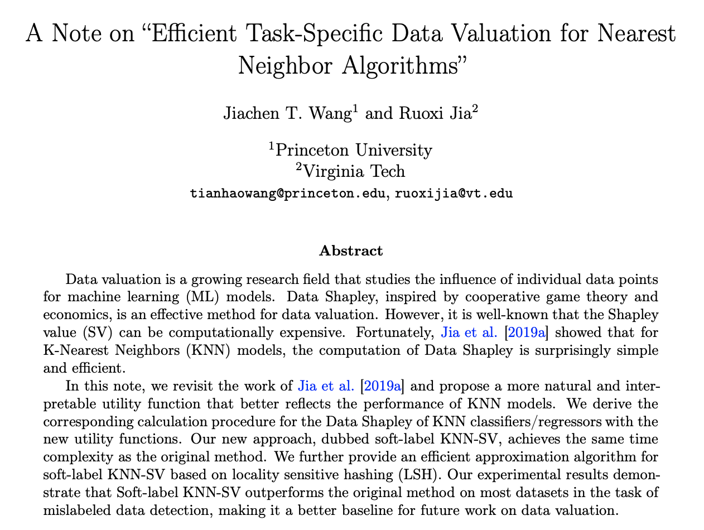

# A Note on "Efficient Task-Specific Data Valuation for Nearest Neighbor Algorithms"

By [Jiachen T. Wang](https://tianhaowang.netlify.app/) and [Ruoxi Jia](https://ruoxijia.info/). 

This repository provides an implementation of for [A Note on "Efficient Task-Specific Data Valuation for Nearest Neighbor Algorithms"](https://arxiv.org/abs/2304.04258). We propose a refined version of KNN-Shapley that uses **a more reasonable utility function**. 

<p align="center">
  
<br>
</p>

## Quick Start

### KNN-SV-RJ refers to the original KNN-Shapley from [Jia et al. (2019)](https://arxiv.org/pdf/1908.08619.pdf) for classification. 
```
python applications_knn.py --task mislabel_detect --dataset creditcard --value_type KNN-SV-RJ --n_data 1000 --n_val 200 --flip_ratio 0.1 --K 5
```

### KNN-SV-JW refers to the newly proposed Soft-label KNN-Shapley for classification (Theorem 2 in this technical note). 
```
python applications_knn.py --task mislabel_detect --dataset creditcard --value_type KNN-SV-JW --n_data 1000 --n_val 200 --flip_ratio 0.1 --K 5
```


## Related Repositories

[Beta Shapley](https://github.com/ykwon0407/beta_shapley) by Yongchan Kwon.

[Data Banzhaf](https://github.com/Jiachen-T-Wang/data-banzhaf) by Jiachen T. Wang and Ruoxi Jia. 
